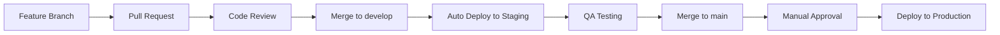

# 🌍 Configuração de Múltiplos Ambientes (Opcional)

Se você quiser ter ambientes separados (staging/production), aqui está como configurar:

## Estrutura de Branches e Ambientes

```
main branch      → Production Environment
develop branch   → Staging Environment  
feat/* branches  → Development (apenas testes)
```

## Configuração Avançada do CI/CD

### 1. Múltiplos Ambientes no ECR

```yaml
# .github/workflows/cicd.yml (versão avançada)
env:
  AWS_REGION: us-east-1
  ECR_REPOSITORY: fiap-vehicle-sale
  PRODUCTION_ECS_SERVICE: fiap-vehicle-sales-service
  PRODUCTION_ECS_CLUSTER: fiap-vehicle-sales-cluster
  STAGING_ECS_SERVICE: fiap-vehicle-sales-staging-service
  STAGING_ECS_CLUSTER: fiap-vehicle-sales-staging-cluster
  ECR_REGISTRY: 497986631333.dkr.ecr.us-east-1.amazonaws.com

jobs:
  deploy-staging:
    name: Deploy to Staging
    runs-on: ubuntu-latest
    needs: test-and-build
    if: github.ref == 'refs/heads/develop'
    environment: staging
    
    steps:
      # ... passos similares ao deploy normal
      - name: Deploy to Staging ECS
        run: |
          aws ecs update-service \
            --cluster $STAGING_ECS_CLUSTER \
            --service $STAGING_ECS_SERVICE \
            --force-new-deployment

  deploy-production:
    name: Deploy to Production
    runs-on: ubuntu-latest
    needs: test-and-build
    if: github.ref == 'refs/heads/main'
    environment: production
    
    steps:
      # ... passos similares
      - name: Deploy to Production ECS
        run: |
          aws ecs update-service \
            --cluster $PRODUCTION_ECS_CLUSTER \
            --service $PRODUCTION_ECS_SERVICE \
            --force-new-deployment
```

### 2. GitHub Environments

1. **Settings → Environments**
2. Criar ambientes:
   - `staging`
   - `production`

3. **Protection Rules para Production**:
   - ✅ Required reviewers (1-2 pessoas)
   - ✅ Wait timer (5 minutos)
   - ✅ Restrict pushes to protected branches

### 3. Secrets por Ambiente

#### Staging
- `STAGING_AWS_ACCESS_KEY_ID`
- `STAGING_AWS_SECRET_ACCESS_KEY`

#### Production  
- `PRODUCTION_AWS_ACCESS_KEY_ID`
- `PRODUCTION_AWS_SECRET_ACCESS_KEY`

## Fluxo de Trabalho Recomendado



### Comandos do Dia a Dia

```bash
# 1. Desenvolver feature
git checkout -b feat/nova-funcionalidade
# ... fazer mudanças
git commit -m "feat: adicionar nova funcionalidade"
git push origin feat/nova-funcionalidade

# 2. Criar Pull Request para develop
# GitHub UI: feat/nova-funcionalidade → develop

# 3. Após aprovação, merge para develop
# → Dispara deploy automático para staging

# 4. Testar no ambiente de staging
curl https://staging-fiap-vehicle-sales.com/health

# 5. Se tudo OK, criar PR para main
# GitHub UI: develop → main

# 6. Após aprovação, merge para main
# → Dispara deploy para production (com aprovação manual)
```

## Configuração Terraform para Múltiplos Ambientes

### Workspaces Terraform

```bash
# Criar workspaces
cd terraform
terraform workspace new staging
terraform workspace new production

# Deploy staging
terraform workspace select staging
terraform apply -var-file="staging.tfvars"

# Deploy production  
terraform workspace select production
terraform apply -var-file="production.tfvars"
```

### Arquivos de Variáveis

**staging.tfvars**
```hcl
environment = "staging"
cluster_name = "fiap-vehicle-sales-staging-cluster"
service_name = "fiap-vehicle-sales-staging-service"
alb_name = "fiap-vehicle-sales-staging-alb"
desired_count = 1
instance_type = "t3.micro"
```

**production.tfvars**
```hcl
environment = "production"
cluster_name = "fiap-vehicle-sales-cluster"
service_name = "fiap-vehicle-sales-service" 
alb_name = "fiap-vehicle-sales-alb"
desired_count = 2
instance_type = "t3.small"
```

## Monitoramento por Ambiente

### URLs

**Staging**
- Health: https://staging-api.fiap-vendas.com/health
- Swagger: https://staging-api.fiap-vendas.com/api-docs

**Production**
- Health: https://api.fiap-vendas.com/health  
- Swagger: https://api.fiap-vendas.com/api-docs

### Logs e Métricas

- **CloudWatch**: Separar log groups por ambiente
- **Alertas**: Configurar alertas diferentes para staging vs production
- **Dashboards**: Criar dashboards específicos por ambiente

## Rollback Strategy

### GitHub Actions

```yaml
- name: Rollback on Failure
  if: failure()
  run: |
    echo "Deployment failed, rolling back..."
    # Buscar versão anterior estável
    PREVIOUS_TAG=$(git describe --tags --abbrev=0 HEAD~1)
    
    # Build da versão anterior
    docker build -t $ECR_REGISTRY/$ECR_REPOSITORY:$PREVIOUS_TAG .
    docker push $ECR_REGISTRY/$ECR_REPOSITORY:$PREVIOUS_TAG
    
    # Deploy da versão anterior
    aws ecs update-service \
      --cluster $ECS_CLUSTER \
      --service $ECS_SERVICE \
      --task-definition $TASK_DEFINITION:$PREVIOUS_REVISION
```

## Database Migrations

### Separar por Ambiente

```yaml
- name: Run Database Migrations
  run: |
    if [ "${{ github.ref }}" == "refs/heads/main" ]; then
      npm run migrate:production
    else
      npm run migrate:staging
    fi
```

### Scripts de Migration

**package.json**
```json
{
  "scripts": {
    "migrate:staging": "DATABASE_URL=$STAGING_DB_URL npm run migrate",
    "migrate:production": "DATABASE_URL=$PRODUCTION_DB_URL npm run migrate"
  }
}
```
