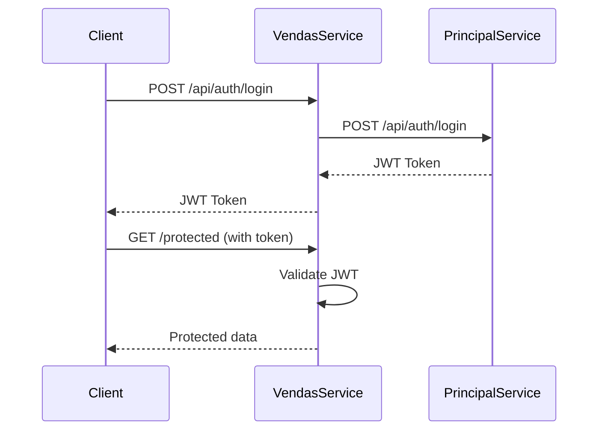

# Serviço de Vendas - Gestão de Transações de Veículos

Este é o serviço de vendas que integra com o serviço principal para autenticação e gerenciamento de transações de veículos, incluindo processamento de pagamentos e notificações via webhook.

## 🏗️ Arquitetura

O serviço segue a **Arquitetura Hexagonal (Ports and Adapters)**, separando claramente as responsabilidades:

- **Domain**: Entidades e regras de negócio
- **Application**: Casos de uso e orquestração  
- **Infrastructure**: Implementações técnicas (HTTP, Database, External Services)

## 🚀 Funcionalidades Implementadas

### Autenticação
- ✅ Login via serviço principal
- ✅ Registro de novos clientes
- ✅ Validação de tokens JWT
- ✅ Middleware de autenticação
- ✅ Proteção de rotas

### Consulta de Veículos
- ✅ Listagem de veículos à venda com ordenação por preço
- ✅ Ordenação ASC (mais barato para mais caro) e DESC (mais caro para mais barato)
- ✅ Filtros por marca, modelo, ano e preço
- ✅ Integração com serviço principal via API

### Gestão de Vendas 🆕
- ✅ Criação de pedidos de venda
- ✅ Processamento de pagamentos via webhook
- ✅ Banco de dados MySQL para persistência
- ✅ Sistema de status (pendente, processando, aprovado, rejeitado, cancelado)
- ✅ Validação de CPF e dados de venda
- ✅ Controle de vendas duplicadas por veículo

### Notificações Webhook 🆕
- ✅ CronJob automático para processar webhooks pendentes
- ✅ Notificação para serviço externo quando venda é aprovada
- ✅ Sistema de retry com limite de tentativas
- ✅ Log completo de tentativas de webhook
- ✅ Processamento em background

## 🔧 Tecnologias Utilizadas

- **Node.js** + **TypeScript**
- **Express.js** - Framework web
- **MySQL2** - Banco de dados e driver
- **Axios** - Cliente HTTP para comunicação com serviços externos
- **JWT** - Autenticação
- **Jest** - Framework de testes
- **Swagger** - Documentação da API
- **UUID** - Geração de identificadores únicos
- **Express Validator** - Validação de dados

## 📋 Pré-requisitos

- Node.js 18+
- NPM ou Yarn
- MySQL 5.7+ ou 8.0+
- Serviço principal rodando na porta 3000

## 🛠️ Instalação e Configuração

### 1. Clone e instale dependências

```bash
cd servico-vendas
npm install
```

### 2. Configure o banco de dados MySQL

Execute o script SQL para criar o banco e tabelas:

```bash
# Entre no MySQL
mysql -u root -p

# Execute o script de setup
source database/setup.sql
```

Ou execute manualmente as queries do arquivo `database/setup.sql`.

### 3. Configure variáveis de ambiente

Copie o arquivo `.env.example` para `.env` e ajuste as configurações:

```env
# Configurações do Banco de Dados MySQL
DB_HOST=localhost
DB_PORT=3306
DB_USER=root
DB_PASSWORD=sua_senha_mysql
DB_NAME=servico_vendas

# URL do webhook externo para notificar vendas
EXTERNAL_WEBHOOK_URL=http://localhost:3001/api/webhook/pagamento

# Configurações do servidor
PORT=3000
NODE_ENV=development

# URL do Serviço Principal
SERVICO_PRINCIPAL_URL=http://localhost:3000

# Configurações de Autenticação
JWT_SECRET=sua_chave_secreta_aqui

# Configurações do cronjob
CRONJOB_INTERVAL_SECONDS=10

# Configurações de timeout para webhooks
WEBHOOK_TIMEOUT_MS=5000
WEBHOOK_MAX_TENTATIVAS=5
```

### 4. Execute o serviço

```bash
# Desenvolvimento
npm run dev

# Produção
npm run build
npm start
```

O serviço irá:
- ✅ Conectar e inicializar o banco de dados automaticamente
- ✅ Iniciar o CronJob para processar webhooks pendentes
- ✅ Disponibilizar todas as APIs de vendas

## 📖 Documentação da API

A documentação Swagger está disponível em: `http://localhost:3001/api-docs`

### Endpoints Disponíveis

#### Autenticação

| Método | Endpoint | Descrição | Autenticação |
|--------|----------|-----------|-------------|
| POST | `/api/auth/login` | Fazer login | ❌ |
| POST | `/api/auth/registrar` | Registrar cliente | ❌ |

#### Veículos

| Método | Endpoint | Descrição | Autenticação |
|--------|----------|-----------|-------------|
| GET | `/api/veiculos/a-venda` | Listar veículos à venda com ordenação por preço | ❌ |

#### Vendas 🆕

| Método | Endpoint | Descrição | Autenticação |
|--------|----------|-----------|-------------|
| POST | `/api/vendas` | Criar nova venda | ❌ |
| GET | `/api/vendas/{id}` | Buscar venda por ID | ❌ |
| GET | `/api/vendas` | Listar vendas (admin vê todas, usuário vê apenas suas vendas) | ✅ |

**Filtros disponíveis para veículos:**
- `marca` - Filtrar por marca
- `modelo` - Filtrar por modelo
- `anoMin` - Ano mínimo
- `anoMax` - Ano máximo
- `precoMin` - Preço mínimo
- `precoMax` - Preço máximo
- `ordem` - Ordenação por preço (`ASC` = mais barato para mais caro, `DESC` = mais caro para mais barato)

**Filtros disponíveis para vendas:**
- `cpf` - CPF do comprador
- `veiculoId` - ID do veículo
- `limite` - Número máximo de registros (1-100)
- `offset` - Número de registros para pular

#### Health Check

| Método | Endpoint | Descrição |
|--------|----------|-----------|
| GET | `/health` | Status do serviço |

### Exemplos de Uso

#### Consultar Veículos à Venda

##### Listar todos os veículos à venda (ordenado por preço crescente - padrão)
```bash
curl http://localhost:3001/api/veiculos/a-venda
```

##### Listar veículos ordenados do mais caro para o mais barato
```bash
curl http://localhost:3001/api/veiculos/a-venda?ordem=DESC
```

##### Filtrar por marca e ordenar por preço crescente
```bash
curl "http://localhost:3001/api/veiculos/a-venda?marca=Toyota&ordem=ASC"
```

##### Filtrar por faixa de preço e ordenar do mais caro para o mais barato
```bash
curl "http://localhost:3001/api/veiculos/a-venda?precoMin=50000&precoMax=100000&ordem=DESC"
```

##### Filtro completo com todos os parâmetros
```bash
curl "http://localhost:3001/api/veiculos/a-venda?marca=Honda&modelo=Civic&anoMin=2020&anoMax=2024&precoMin=60000&precoMax=120000&ordem=ASC"
```

### Exemplos de Uso das APIs de Venda 🆕

#### 1. Criar uma nova venda

```bash
curl -X POST http://localhost:3000/api/vendas \
  -H "Content-Type: application/json" \
  -d '{
    "veiculoId": "1",
    "cpfComprador": "12345678901",
    "valorPago": 85000,
    "metodoPagamento": "cartao_credito"
  }'
```

#### 2. Buscar venda por ID

```bash
curl http://localhost:3000/api/vendas/123e4567-e89b-12d3-a456-426614174000
```

#### 3. Listar vendas com filtros

```bash
# Todas as vendas
curl http://localhost:3000/api/vendas

# Vendas por CPF
curl http://localhost:3000/api/vendas?cpf=12345678901

# Vendas por veículo
curl http://localhost:3000/api/vendas?veiculoId=1

# Com paginação
curl http://localhost:3000/api/vendas?limite=10&offset=20
```

#### 4. Processar webhook de pagamento

### Fluxo Completo de Venda

1. **Cliente cria venda** → Status: `pendente`
2. **Sistema de pagamento processa** → Webhook recebido
3. **Status atualizado** → `aprovado` ou `rejeitado`
4. **CronJob detecta venda aprovada** → Notifica serviço externo
5. **Serviço externo remove disponibilidade** → Venda concluída

## 🧪 Testes

### Executar testes

```bash
# Executar todos os testes
npm test

# Executar com watch
npm run test:watch

# Cobertura de testes
npm run test:coverage
```

### Estrutura de Testes

```
src/__tests__/
├── setup.ts                    # Configuração global dos testes
├── infrastructure/
│   ├── services/
│   │   └── ExternalAuthenticationService.test.ts
│   └── http/
│       └── controllers/
│           └── AuthController.test.ts
```

## 🔒 Segurança

- Rate limiting configurado
- Headers de segurança com Helmet
- Validação de entrada
- Tokens JWT para autenticação
- CORS configurado

## 🤝 Integração com Serviço Principal

O serviço de vendas se comunica com o serviço principal através de:

1. **Login**: `POST /api/auth/login`
2. **Registro**: `POST /api/auth/registrar-cliente`

### Fluxo de Autenticação



## 📝 Scripts Disponíveis

```json
{
  "dev": "Executar em modo desenvolvimento",
  "build": "Compilar TypeScript",
  "start": "Executar versão compilada",
  "test": "Executar testes",
  "test:watch": "Executar testes em modo watch",
  "test:coverage": "Gerar relatório de cobertura",
  "lint": "Verificar código com ESLint",
  "lint:fix": "Corrigir problemas de lint automaticamente"
}
```

## 🚦 Status do Projeto

- ✅ Configuração inicial
- ✅ Serviço de autenticação
- ✅ Middleware de autenticação
- ✅ Testes básicos
- ✅ Documentação Swagger
- ⏳ Gestão de veículos (próximo)
- ⏳ Processamento de vendas (próximo)
- ⏳ Webhook de pagamento (próximo)

## 🔍 Monitoramento

### Health Check

```bash
curl http://localhost:3001/health
```

Resposta:
```json
{
  "status": "OK",
  "service": "servico-vendas",
  "timestamp": "2025-08-22T16:50:00.000Z",
  "uptime": 123.456
}
```

## 🤔 Troubleshooting

### Problemas Comuns

1. **Serviço principal indisponível**
   - Verifique se o serviço principal está rodando na porta 3000
   - Confirme a URL no arquivo `.env`

2. **Erro de autenticação**
   - Verifique se o JWT_SECRET é o mesmo nos dois serviços
   - Confirme se o token está sendo enviado corretamente

3. **Testes falhando**
   - Execute `npm install` para garantir que todas as dependências estão instaladas
   - Verifique se não há conflitos de porta

## 🎯 Próximos Passos

1. Implementar gestão de veículos
2. Criar sistema de vendas
3. Integrar webhook de pagamento
4. Adicionar banco de dados MySQL
5. Implementar CI/CD
6. Configurar Docker

## 📞 Suporte

Para dúvidas ou problemas, consulte a documentação ou entre em contato com a equipe de desenvolvimento.
