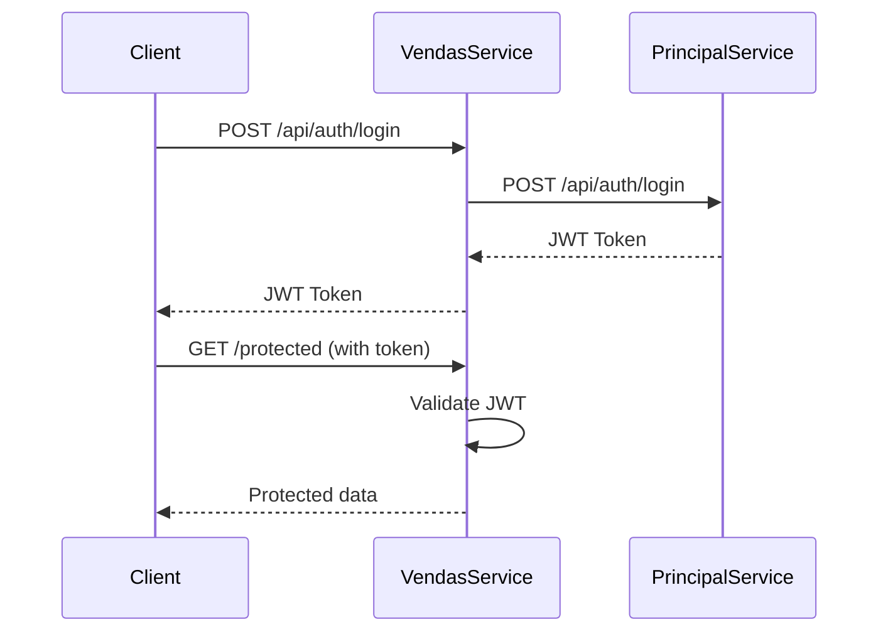

# Serviço de Vendas - Gestão de Transações de Veículos

Este é o serviço de vendas que integra com o serviço principal para autenticação e gerenciamento de transações de veículos.

## 🏗️ Arquitetura

O serviço segue a **Arquitetura Hexagonal (Ports and Adapters)**, separando claramente as responsabilidades:

- **Domain**: Entidades e regras de negócio
- **Application**: Casos de uso e orquestração
- **Infrastructure**: Implementações técnicas (HTTP, Database, External Services)

## 🚀 Funcionalidades Implementadas

### Autenticação
- ✅ Login via serviço principal
- ✅ Registro de novos clientes
- ✅ Validação de tokens JWT
- ✅ Middleware de autenticação
- ✅ Proteção de rotas

### Consulta de Veículos
- ✅ Listagem de veículos à venda (ordenada por preço crescente)
- ✅ Listagem de veículos vendidos (ordenada por preço crescente - requer admin)
- ✅ Filtros por marca, modelo, ano e preço
- ✅ Integração com serviço principal via API

## 🔧 Tecnologias Utilizadas

- **Node.js** + **TypeScript**
- **Express.js** - Framework web
- **Axios** - Cliente HTTP para comunicação com serviço principal
- **JWT** - Autenticação
- **Jest** - Framework de testes
- **Swagger** - Documentação da API
- **MySQL** - Banco de dados (futuro)

## 📋 Pré-requisitos

- Node.js 18+
- NPM ou Yarn
- Serviço principal rodando na porta 3000

## 🛠️ Instalação e Configuração

### 1. Clone e instale dependências

```bash
cd servico-vendas
npm install
```

### 2. Configure variáveis de ambiente

Copie o arquivo `.env` e ajuste as configurações:

```env
# Configurações do Servidor
PORT=3001
NODE_ENV=development

# URL do Serviço Principal
SERVICO_PRINCIPAL_URL=http://localhost:3000

# Configurações de Autenticação
JWT_SECRET=sua_chave_secreta_aqui
```

### 3. Execute o serviço

```bash
# Desenvolvimento
npm run dev

# Produção
npm run build
npm start
```

## 📖 Documentação da API

A documentação Swagger está disponível em: `http://localhost:3001/api-docs`

### Endpoints Disponíveis

#### Autenticação

| Método | Endpoint | Descrição | Autenticação |
|--------|----------|-----------|-------------|
| POST | `/api/auth/login` | Fazer login | ❌ |
| POST | `/api/auth/registrar` | Registrar cliente | ❌ |

#### Veículos

| Método | Endpoint | Descrição | Autenticação |
|--------|----------|-----------|-------------|
| GET | `/api/veiculos/a-venda` | Listar veículos à venda | ❌ |
| GET | `/api/veiculos/vendidos` | Listar veículos vendidos | ✅ (Admin) |

**Filtros disponíveis para ambas as rotas:**
- `marca` - Filtrar por marca
- `modelo` - Filtrar por modelo
- `anoMin` - Ano mínimo
- `anoMax` - Ano máximo
- `precoMin` - Preço mínimo
- `precoMax` - Preço máximo

#### Health Check

| Método | Endpoint | Descrição |
|--------|----------|-----------|
| GET | `/health` | Status do serviço |

## 🧪 Testes

### Executar testes

```bash
# Executar todos os testes
npm test

# Executar com watch
npm run test:watch

# Cobertura de testes
npm run test:coverage
```

### Estrutura de Testes

```
src/__tests__/
├── setup.ts                    # Configuração global dos testes
├── infrastructure/
│   ├── services/
│   │   └── ExternalAuthenticationService.test.ts
│   └── http/
│       └── controllers/
│           └── AuthController.test.ts
```

## 🔒 Segurança

- Rate limiting configurado
- Headers de segurança com Helmet
- Validação de entrada
- Tokens JWT para autenticação
- CORS configurado

## 🤝 Integração com Serviço Principal

O serviço de vendas se comunica com o serviço principal através de:

1. **Login**: `POST /api/auth/login`
2. **Registro**: `POST /api/auth/registrar-cliente`

### Fluxo de Autenticação



## 📝 Scripts Disponíveis

```json
{
  "dev": "Executar em modo desenvolvimento",
  "build": "Compilar TypeScript",
  "start": "Executar versão compilada",
  "test": "Executar testes",
  "test:watch": "Executar testes em modo watch",
  "test:coverage": "Gerar relatório de cobertura",
  "lint": "Verificar código com ESLint",
  "lint:fix": "Corrigir problemas de lint automaticamente"
}
```

## 🚦 Status do Projeto

- ✅ Configuração inicial
- ✅ Serviço de autenticação
- ✅ Middleware de autenticação
- ✅ Testes básicos
- ✅ Documentação Swagger
- ⏳ Gestão de veículos (próximo)
- ⏳ Processamento de vendas (próximo)
- ⏳ Webhook de pagamento (próximo)

## 🔍 Monitoramento

### Health Check

```bash
curl http://localhost:3001/health
```

Resposta:
```json
{
  "status": "OK",
  "service": "servico-vendas",
  "timestamp": "2025-08-22T16:50:00.000Z",
  "uptime": 123.456
}
```

## 🤔 Troubleshooting

### Problemas Comuns

1. **Serviço principal indisponível**
   - Verifique se o serviço principal está rodando na porta 3000
   - Confirme a URL no arquivo `.env`

2. **Erro de autenticação**
   - Verifique se o JWT_SECRET é o mesmo nos dois serviços
   - Confirme se o token está sendo enviado corretamente

3. **Testes falhando**
   - Execute `npm install` para garantir que todas as dependências estão instaladas
   - Verifique se não há conflitos de porta

## 🎯 Próximos Passos

1. Implementar gestão de veículos
2. Criar sistema de vendas
3. Integrar webhook de pagamento
4. Adicionar banco de dados MySQL
5. Implementar CI/CD
6. Configurar Docker

## 📞 Suporte

Para dúvidas ou problemas, consulte a documentação ou entre em contato com a equipe de desenvolvimento.
